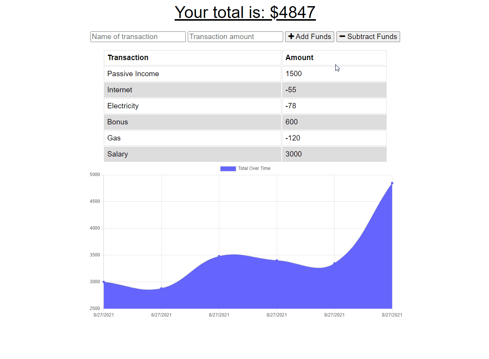

# adrianos-budget-tracker-19

Homework 19 -  Budget Tracker

## GitHub Repository 🚀

- [GitHub Repo Link](https://github.com/AdrianoArmen/adrianos-budget-tracker-19)

## App Deployment on Heroku 📦

- [App Deploy Link](https://glacial-peak-56378.herokuapp.com/)

## Project Description 📋

This PWA works as a budget tracker with an Online/Offline functionality that enables the user to add or subtract from the budget while being disconnected. The assignment showcases my knowledge of PWA building and a proper webmanifest and service worker structure with the option of installation using custom icons. It works with a [MongoDB Atlas](https://www.mongodb.com/es/cloud/atlas/register) database and a [Heroku](https://dashboard.heroku.com/apps) deployment.

## Mockup 🔧

- The following animation demonstrates the actual application functionality:

## Technologies used 🛠️

- [MongoDB](https://www.mongodb.com/es/cloud/atlas) - global cloud database service
- [Mongoose](https://mongoosejs.com/) - database shchema and validation for MongoDB
- [Heroku](https://dashboard.heroku.com/apps) - deployment platform
- [NPM](https://www.npmjs.com/) - package manager

## License 📄

This project is licensed under the MIT License - see the [LICENSE.md](LICENSE.md) file for details

---

© 2021 Adriano.

